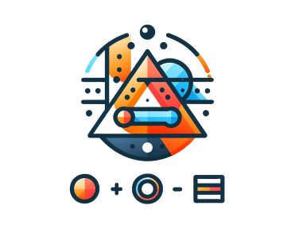

# Gizzy: cálculo de área

---
## Objetivo do projeto.
O objetivo deste projeto é aplicar de forma prática os conceitos aprendidos durante as aulas de Jetpack Compose. O aplicativo proposto tem como funcionalidade principal o cálculo de áreas de diferentes formas geométricas, oferecendo uma ferramenta intuitiva que não apenas simplifica os cálculos matemáticos, mas também torna o aprendizado mais envolvente e criativo.

## Status: projeto em andamento.
As principais funcionalidades do aplicativo, estão em desenvolvimento.

---

### Tecnologias usadas

---

## Jornada do usuário

Bem-vindo à sua jornada no universo das formas geométricas!

Imagine abrir o aplicativo e ser recebido por uma interface amigável que convida você a explorar o mundo da matemática de forma prática e divertida.

* Entrada no Universo Matemático: Tela de Cadastro ou Login *
Sua aventura começa com um passo simples: criar uma conta ou fazer login. Aqui, você estabelece sua identidade matemática, garantindo acesso às funcionalidades personalizadas. Depois, nas configurações do aplicativo, você pode escolher um avatar que representará o seu perfil durante a jornada.

* Explorando o Plano: Cálculos de Formas Planas *
Na tela inicial, você encontra opções para calcular áreas de figuras bidimensionais, como triângulos, círculos e trapézios. Com poucos toques, você seleciona a forma desejada, insere as dimensões e recebe o resultado detalhado, acompanhado de uma explicação sobre o cálculo realizado.

* Subindo ao Espaço: Formas 3D *
Avance para a próxima dimensão explorando volumes de sólidos, como cubos, esferas e cones. A interface oferece visualizações interativas, permitindo que você gire os objetos e compreenda melhor as proporções e os cálculos envolvidos.

* Dominando a Estrutura: Prismas e Formas Compostas *
Para os mais aventureiros, há uma seção dedicada a prismas e formas geométricas compostas. Você escolhe uma figura complexa, insere os dados necessários, e o aplicativo realiza os cálculos, exibindo o volume total, áreas laterais e outras informações relevantes.

---

## Próximos passos 

---

### Curto Prazo 
- [ ] Desenvolver as telas dedicadas aos cálculos geométricos, garantindo funcionalidade e usabilidade.
- [ ] Criar a tela de configurações, permitindo ajustes personalizados.
- [ ] Implementar a funcionalidade de escolha de avatares, acessível nas configurações.

### Médio Prazo 
- [ ] Categorizar as figuras geométricas em três grupos principais: formas planas, prismas e formas tridimensionais (3D).
- [ ] Ajustar a interface para facilitar a navegação entre as diferentes classificações.

### Longo Prazo 
- [ ] Expandir as funcionalidades de cálculo, incluindo conversões entre diferentes unidades de medida (área, volume) e massa.
- [ ] Implementar cálculos químicos, permitindo resolver fórmulas básicas, como molaridade, densidade, e transformações de unidades químicas.
---
## Identidade Visual
---

A identidade visual é o equilíbrio perfeito entre *criatividade e modernidade*, combinando um design minimalista com uma abordagem divertida e intuitiva.

**Cores**
---
| Cor           | Código HEX | Exemplo    |
|---------------|------------|------------|
| Opal Green    | #BCCFC9    |  |
| Wintergreen   | #57908A    |  |
| Prussian Blue | #123145    | |
| Sunray        | #EAB364    | |
| Sandrift      | #CFB394    | |
---
**Tipografia**
---
* lilita one

Essa fonte foi selecionada por sua alta legibilidade, garantindo uma experiência de leitura clara, confortável e visual moderno. 

---

